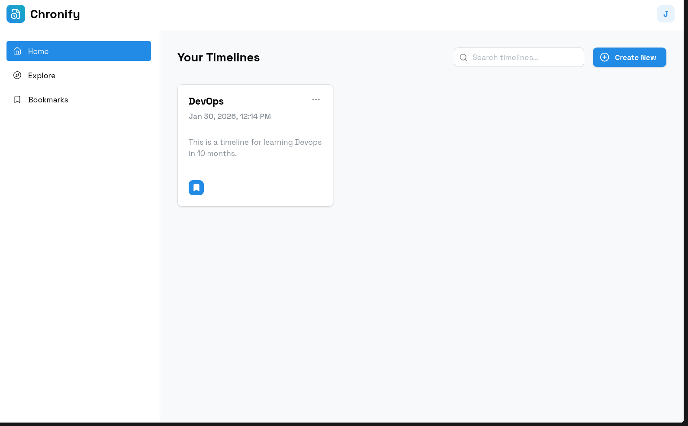
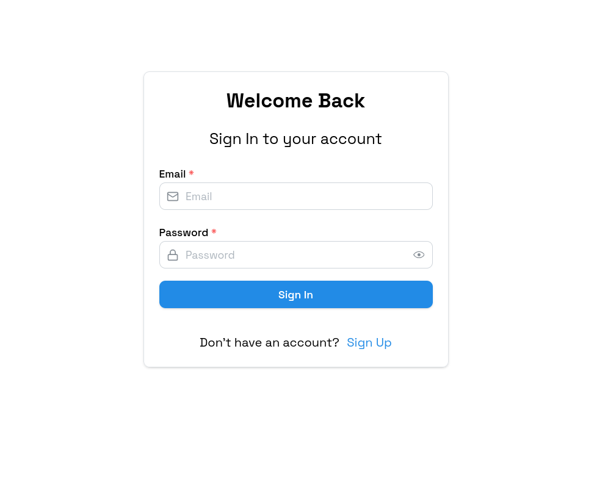
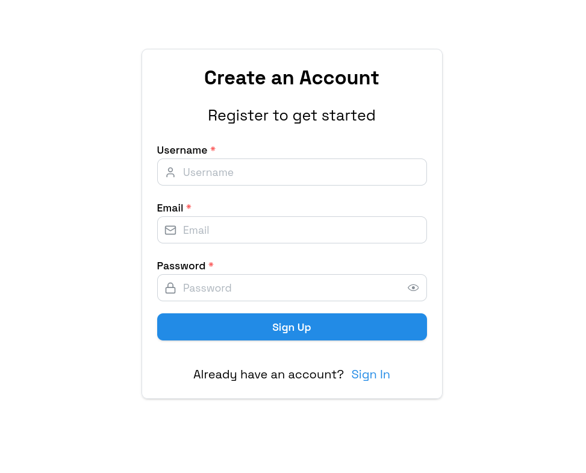
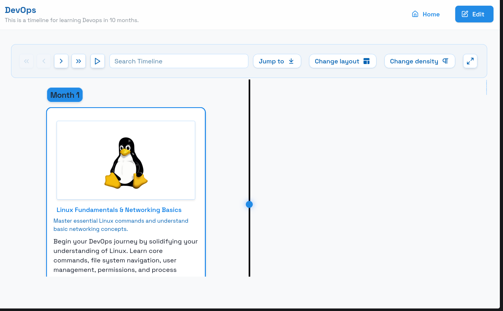

# Chronify

> A timeline creating web app with Gemini AI integration.

---

## What is Chronify?

Chronify lets you generate beautiful, structured timelines from plain text input — powered by Google's Gemini AI. Describe a topic, a historical event, a project roadmap, or anything time-based, and Chronify will produce a clean visual timeline for you.

---

## Tech Stack

| Layer    | Technology         |
| -------- | ------------------ |
| Frontend | TypeScript / React |
| Backend  | Go                 |
| AI       | Google Gemini API  |

---

## Screenshots

### Home

### Login

### Register

### Timeline View

